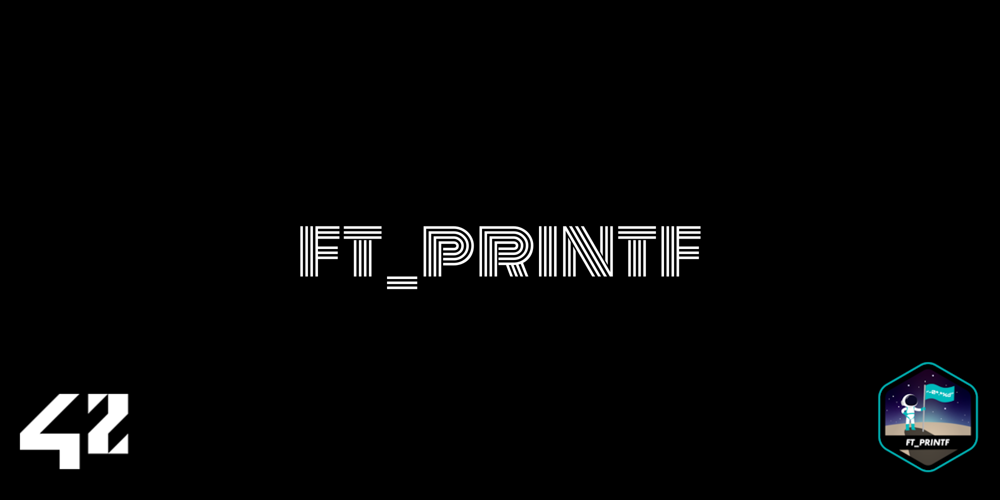

---



## Because putnbr() and putstr() are not enough…

---

## Evaluation:


## Table of Contents

1. [What is ft_printf?](https://github.com/VolmerES/ft_printf?tab=readme-ov-file#what-is-ft_printf)
2. [What’s inside?](https://github.com/VolmerES/ft_printf?tab=readme-ov-file#whats-inside)
3. [How does it work?](https://github.com/VolmerES/ft_printf?tab=readme-ov-file#how-does-it-work)
4. [How to test ?](https://github.com/VolmerES/ft_printf?tab=readme-ov-file#how-to-test-)
5. [Notes](https://github.com/VolmerES/ft_printf?tab=readme-ov-file#notes)
6. [About Me](https://github.com/VolmerES/ft_printf?tab=readme-ov-file#-about-me)
7. [License](https://github.com/VolmerES/ft_printf?tab=readme-ov-file#license)

## What is ft_printf?

---

ft_printf is a custom implementation of the C standard library function printf in C. This project provides a versatile and extensible printf function that can be used to format and print various data types to the standard output. It offers a comprehensive set of format specifiers, allowing you to control the appearance of data in your C programs. Designed as a learning exercise, this printf implementation serves as a useful educational tool for understanding string formatting and variadic functions in C

## What’s inside?

---

| Functions | Other |
| --- | --- |
| ft_printf.c | Makefile |
| ft_putnbr_base.c | ft_printf.h |
| ft_strlen.c |  |
| ft_putstr_fd.c |  |
| ft_putchar_fd.c |  |

## How does it work?

---

1. Clona este repositorio y entra en él, asegúrate de que se llama:

```bash
git clone <https://github.com/VolmerES/ft_printf.git>
cd ft_printf/
```

1. Ejecuta Make para que puedas construir la biblioteca:

```bash
make
```

### Otras reglas del makefile que puedes usar:

```bash
make - compila los archivos obligatorios de libft
make bonus - compila los archivos bonus de libft
make all - compila todos los archivos (obligatorios + bonus)
make clean - elimina todos los archivos *.o
make fclean - elimina todos los archivos *.o y *.a (ejecutables)
make re - usa fclean + all, recompila libft
```

1. Para incluirlo en tu código, incluye la cabecera

```c
#include 'ft_printf.h"
```

## How to test ?

---

[Francinette](https://github.com/xicodomingues/francinette)

**To standart test, go to the library path and run:**

All standard tests should work perfectly.

```bash
$ paco
```

**To strict test, go to the library path and run:**

The “strict” tests do not work correctly, the function does not return -1 and lacks certain protections…

```bash
$ paco -s
```

The “strict” tests do not work correctly, the function does not return -1 and lacks certain protections…

## Notes

The bonus part of the project is not included.

## 🚀 About Me

I’m 42Network student at 42Madrid(Spain)

You I track my progress through the common core at:

More about:

[https://img.shields.io/badge/linkedin-0A66C2?style=for-the-badge&logo=linkedin&logoColor=white](https://img.shields.io/badge/linkedin-0A66C2?style=for-the-badge&logo=linkedin&logoColor=white)

## License

This project is licensed under the MIT License. See the [LICENSE](https://www.notion.so/LICENSE.md) file for details.
